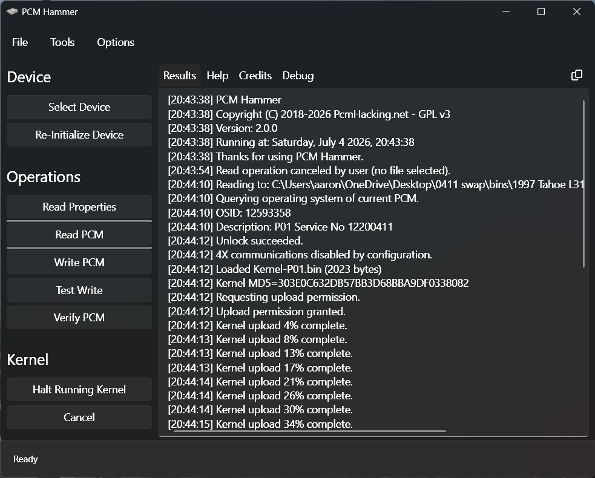
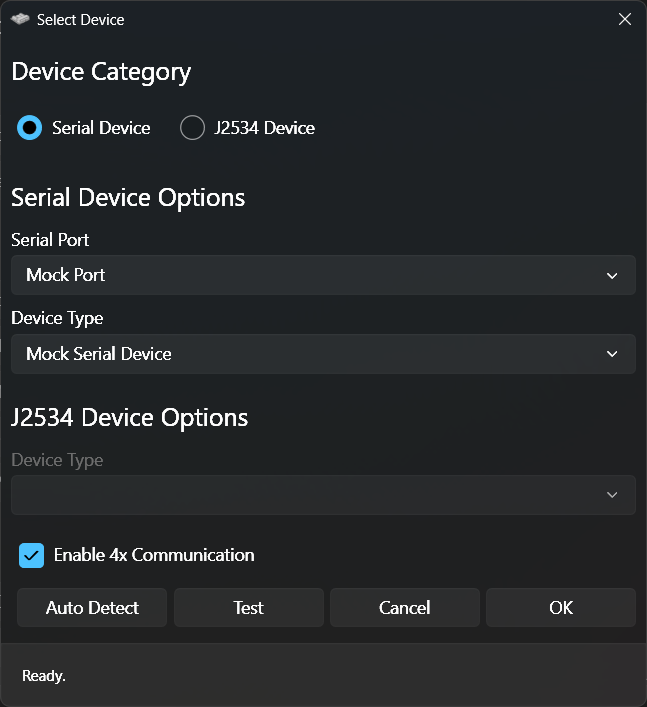

# PCMHammer (WPF MVVM Sandbox Fork)

A modernized, UI-focused fork of the open-source [**PCMHammer**](https://github.com/PcmHammer/PcmHammer) tool, rebuilt using Windows Presentation Foundation (WPF) and the Model-View-ViewModel (MVVM) architectural pattern.


## 🚀 Overview

The goal of this fork is to completely overhaul and modernize the desktop user interface of PCMHammer while operating strictly within a **"sandbox" design methodology**. All front-end enhancements are developed side-by-side with the original codebase, ensuring that the existing WinForms and Uno platform implementations remain untouched and fully operational. 

By maintaining strict separation between the new UI layer and the core backend communication engine, this project aims to provide a drop-in UI upgrade that the core developers can maintain without fracturing the project into separate entities.

---

## 📸 Screenshots
<div style="overflow-x: auto; white-space: nowrap;">
  
  
</div>

---

## 🎯 Key Project Goals

* **Modernized Interface:** Replaces the legacy WinForms UI with a highly responsive, scalable, and scannable WPF layout.
* **MVVM Architecture:** Leverages robust data binding, command structures, and property-changed notifications to decouple UI logic from backend operations.
* **Zero-Regression Architecture:** Guarantees that the underlying flashing, reading, and kernel-execution logic remains unmodified, preserving cross-platform compatibility for Uno and legacy WinForms.
* **Upstream Ready:** Built with clean pull-request integration in mind, making it seamless for the core `PcmHacking.net` team to review and merge.

---

## 🛠️ Tech Stack & Architecture

* **Framework:** .NET / WPF (Windows 11 Compatible)
* **Pattern:** MVVM (Model-View-ViewModel)
* **Core Backend:** Original PCM Hammer J1850 VPW protocol engines, kernel uploaders, and device pipelines.

---

- [x] Initial WPF Project Structure & MVVM scaffolding.
- [x] Mock Device Pipeline implementation for localized testing.
- [x] Real-time debug and operation logging panel integration.
- [/] Implementation of PCM read/write operation ViewModels *(In Progress)*.
- [ ] Final UI styling and polish.

---

## 💻 Getting Started

### Prerequisites
* Windows 10 / 11
* Visual Studio 2022 (with .NET Desktop Development workload installed)

### Building the Project
1. Clone this fork:
   ```bash
   git clone [https://github.com/atshaw1994/PcmHammerMVVM](https://github.com/atshaw1994/PcmHammerMVVM)
   
2. Open the solution file in Visual Studio.

3. Set the PcmHammer.Wpf project as your Startup Project.

4. Build and run (F5).

💡 Tip for Testing: To test the application state machine without hooking up an actual interface hookup, use the Mock Device profile in the connection settings to simulate full kernel uploads and protocol handshakes.

🤝 Contributing & Feedback
This fork is actively developed with the intent to submit a comprehensive Pull Request to the upstream repository at PcmHacking.net. If you encounter bugs specific to the WPF interface or have suggestions for the MVVM architecture, please open an issue or submit a PR directly to this fork.

📄 License
This project is licensed under the GNU General Public License v3 (GPL-3.0) - see the original LICENSE file for details.